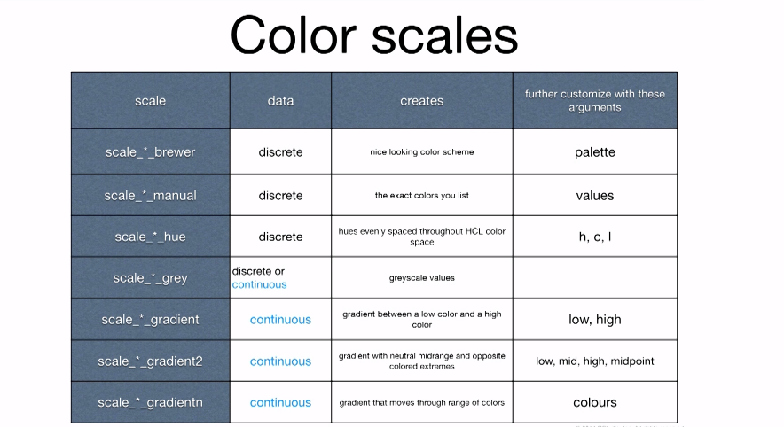

# Customising Graphs
## Scales and Color Schemes
* `scale_<aesthetic>_<scalename>()` can be used to control the scale
* Example 
	`qplot(displ,hwy,data=mpg,color=cty)+scale_color_gradient(low="red",high="yellow")`
	`qplot(displ,hwy,data=mpg,size=cyl)+scale_size_area()`
	`qplot(displ,cty,color=drv,shape=fl,data=mpg)+scale_shape_manual(values=c(0,16,1,16,3))`
* The shape aesthetic can be set manually by specifying each shape. `?pch` gives a mapping of shapes to shape-number
* Color table

* The brewer scale is ideal for providing predefined color palettes that look good.
	`library(RColorBrewer)`
	`display.brewer.all()`

## Themes
* Use `theme_<name>` to control the theme. Example - `theme_gray()`, `theme_bw()`
* Custom themes can be created using `theme()`
* Ex
	`theme(panel.border=element_rect(color="black",fill=NA))`
* ggthemes package comes with a number of themes

## Axis Labels
* `xlab()` and `ylab()` can be used to change the x/y labels
* `xlab("")` removes the label altogether

A complete example of customizing a graph
__tx <- qplot(long,lat,data=texas,geom="polygon",group=group,fill=bin)__
__tx+ylab("")+xlab("")+theme\_bw()+ggtitle("The state of Texas")+scale\_fill\_brewer(palette="Blues")+coord_map()__ 

* `q <- qplot(dspl,hwy,data=mpg,color=cty)`
* The type of legend used can be specified using the `guides` function. Example `guides(color="legend")`. Other options are _none_ and _colorbar_(for continuous variables only)
* Parameters passed to scale functions can be used to customize the legend. Namely `name` and `labels`
* `tx+ylab("")+scale_fill_brewer(palette="Blues",name="Population",labels=c("0-999","1000-9999","10000-99999","100000-999999","1000000-9999999"))+coord_map()`

## Others
* Use extrafont to use system fonts
* ggally
* ggbio
* ggmcmc
* ggvis

